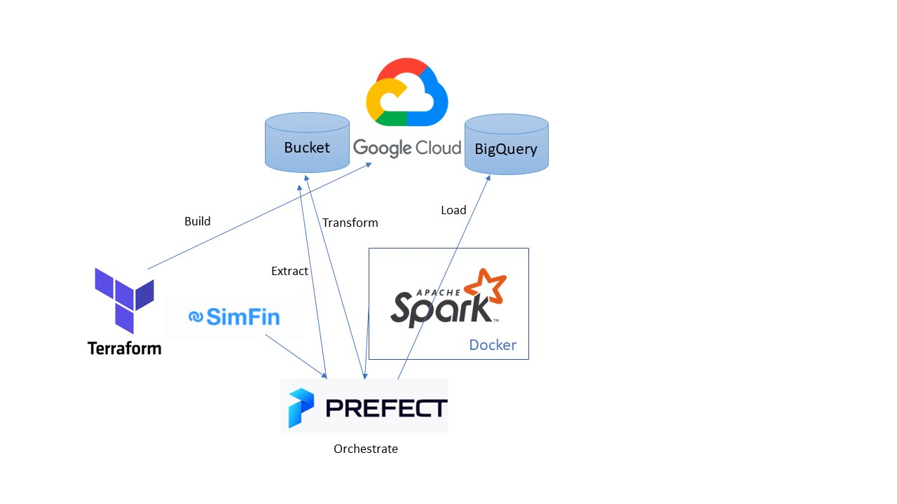

# Data Engineering Zoomcamp 2023 Capstone

This repository contains my capstone project for the amazing Data Engineering Zoomcamp course (2023 edition).

## Objectives

The goals of the project are: 
* Collect finantial data from the US stock market (Extract).
* Process the finantial data to generate derived quantities for further analysis (Transform).
* Save the transformed data in Big Query (Load).
* Orchestrate the full pipeline using an orchestration tool. 
* Generate a report summarizing some of the findings. 

## Techologies 

We have used the following technologies: 
* Terraform for generating all the needed resources in Google Cloud. 
* Prefect for orchestrating the whole data pipeline.
* Spark for transforming the data. 
* Docker for simplifying the installation and usage of Spark. 
* Google Cloud Storage as a Data Lake. 
* Big Query as a Data Warehouse. 

## Components of the project



### Local prerequisites

For reproducibility, the PC must have installed Docker, Python (at least 3.8), git and Terraform.

After that, just clone the repository: 

```bash
git clone https://github.com/JaimeArboleda/de-zoomcamp-capstone.git
```

### Remote prerequisites

For reproducibility, other tools and accounts are needed:
* Google Cloud account with a project. 
* Prefect Cloud free account. 
* Simfin free account (for downloading the data).

### Setting the environment

One of the objectives (albeit not explicitily stated) is to achieve as much automation as possible, without repeating configuration options everywhere (that is, applying the DRY principle). In order to achieve this goal, the only configuration steps (after cloning the repository) that are required are: 

1. Download a JSON credentials file from GCP and place it at the root of the repository named `gcp_credentials.json`.

2. Create a file named `.pyenv` at the root of the repository that will contain all needed configuration. This file must have the following content: 
   
    ```python
    sim-fim-api-key=<YOUR-API-KEY>
    project-name=<YOUR-GCP-PROJECT-ID>
    bucket-name=<YOUR-BUCKET-NAME>
    region=<REGION-FOR-GCS-AND-BQ>
    storage-class=STANDARD # This value should be ok
    dataset-name=<DATASET-NAME>
    ```
    The only two fields that cannot be freely choosed are the first two. The rest can be freely specified. 

3. Create a virtual environment and install the requierements: 

    ```
    python -m venv venv
    pip install -r requirements.txt
    ```

### Building the cloud resources

For this task we rely on terraform. We have found a useful trick that allows us to use the `.pyenv` file instead of duplicating the information. In the file `variables.tf`, we read the configuration file and load it into a dictionary of variables: 

```t
locals {
  envs = { for tuple in regexall("(.*)=([^\\n\\r]*)", file("../.pyenv")) : tuple[0] => tuple[1] }
}
```

In order to create the resources, just two commands need to be executed: 

```
cd terraform
terraform init
terraform apply 
```

You can view the source code [here](./terraform/main.tf) and [here](./terraform/variables.tf).

### Configure Prefect

You need to have a prefect cloud account and to log in in your terminal using the virtual environment (that will have prefect installed). You can follow the instructions [here](https://docs.prefect.io/ui/cloud-quickstart/).

After that, just run the following commands: 

```bash
prefect block register -m prefect_gcp
```

This will register the GCP blocks that are used in the project. 

```bash
python ./init_blocks.py
```

This will create all the blocks automatically using the configuration defined in `.pyenv` and the credentials file. 

You can view the source code [here](./init_blocks.py)
   
### Extract

Just run the following command: 
   
``` 
python ./flows/extract.py
```

The extract flow is a simple flow that uses `simfin` library for retrieving finantial data (three datasetes are obtained) and saves the results as `parquet` files in a Bucket in GCS.

You can view the source code [here](./flows/extract.py)

### Transform

The transformation flow uses Spark. It's a simple flow and the data volume does not justify the use of Spark, but in general, in real settings with big data volumes, it will make much more sense. 

To run the flow, just run: 

```
python ./flows/transform.py
```

However, this flow (that can be examined [here](./flows/transform.py)) does not contain the Spark code: it just run shell commands with two objectives: 
1. Spin up the container that has a Spark Cluster. 
2. Run (`spark-submit`) the corresponding job. 

To see the Spark code you can view this [file](./notebooks/transform.py). 

It's also worth taking a look at the [Dockerfile](./Dockerfile). It's based on an official image with PySpark and JupyterLab, but it contains two useful additions: a jar file that adds capabilities to Spark for interacting with GCS (reading/writing files) and two libraries that are used (`dotenv` and `google-cloud-storage`).

In this step, the Spark code reads the files from the Bucket, perform the transformation step and writes them back to the Bucket. It's worth mentioning that this step is (like the rest of the flows) idempotent (you can safely execute it several times). Besides, only the data that is fresh will be recomputed and overwritten (the processed files are separated by months in order to achieve this).

### Load

Run: 

```
python ./flows/load.py
```

In this step, whose code is available [here](./flows/load.py), an external table (obtained from all parquet files) and a materialized version of it are built in Big Query. 

### Report

The final report (made with Locker Studio by Google) is available [here](https://lookerstudio.google.com/reporting/1ec53650-f26e-40bb-be97-868dc352da57/page/tEnnC).

A [pdf version](./assets/Stock_Market_Analysis.pdf) can be downloaded as well, just in case when the free account is cancelled the report stops working. 